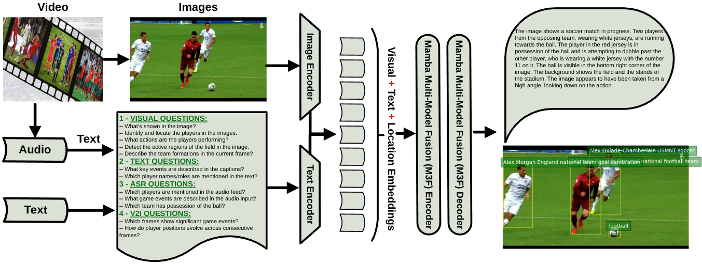

# [IJCV2025] 3MT: Multi-Model Multi-Task Learning for Real-Time Soccer Player Decision-Making Skills Analytics

  [](README.md)


<div align="center">
  
</div>

## Models
We pre-trained 3MT-S, 3MT-M, and 3MT-L from scratch and evaluated them on the `MSCOCO2017` validation set.
### Inference on MSCOCO2017 dataset

| Models | Params| FLOPs | ${AP}^{val}$ | ${AP}_{{50}}^{val}$ | ${AP}_{{75}}^{val}$ | ${AP}_{{S}}^{val}$ | ${AP}_{{M}}^{val}$ | ${AP}_{{L}}^{val}$ |
| :------------------------------------------------------------------------------------------------------------------- | :------------------- | :----------------- | :--------------: | :------------: | :------------: | :------------: | :-------------: | :------------: |
| [3MT-S](./ultralytics/cfg/models/3MT/3MT-S.yaml) | 5.8M | 13.2G |       44.5       |          61.2           |          48.2           |          24.7          |          48.8          |          62.0          |
| [3MT-M](./ultralytics/cfg/models/3MT/3MT-M.yaml) | 19.1M | 45.4G  |       49.1       |          66.5           |          53.5           |          30.6          |          54.0          |          66.4          |
| [3MT-L](./ultralytics/cfg/models/3MT/3MT-L.yaml)  | 57.6M | 156.2G |       52.1       |          69.8           |          56.5           |          34.1          |          57.3          |          68.1          |


## Getting started

### 1. Installation

3MT is developed based on `torch==2.3.0` `pytorch-cuda==12.1` and `CUDA Version==12.6`. 

#### 2.Clone Project 

```bash
git clone https://github.com/MrFahad/3MT.git
```

#### 3.Create and activate a conda environment.
```bash
conda create -n 3mt -y python=3.11
conda activate 3mt
```

#### 4. Install torch

```bash
pip3 install torch===2.3.0 torchvision torchaudio
```

#### 5. Install Dependencies
```bash
pip install seaborn thop timm einops
cd selective_scan && pip install . && cd ..
pip install -v -e .
```

#### 6. Prepare MSCOCO2017 Dataset
Make sure your dataset structure as follows:
```
├── coco
│   ├── annotations
│   │   ├── instances_train2017.json
│   │   └── instances_val2017.json
│   ├── images
│   │   ├── train2017
│   │   └── val2017
│   ├── labels
│   │   ├── train2017
│   │   ├── val2017
```

#### 7. Training 3MT-S
```bash
python 3mt_train.py --task train --data ultralytics/cfg/datasets/coco.yaml \
 --config ultralytics/cfg/models/3MT/3MT-S.yaml \
--amp  --project ./output_dir/mscoco --name 3mt_s
```

## Acknowledgement

This repository builds upon several open-source projects and research contributions. The real-time object detection foundation is adapted from [Ultralytics](https://github.com/ultralytics/ultralytics) and [Mamba YOLO](https://github.com/HZAI-ZJNU/Mamba-YOLO). The selective scan mechanism is inspired by [VMamba](https://github.com/MzeroMiko/VMamba), while the contrastive vision encoder is based on [SigLip](https://arxiv.org/abs/2303.15343). Additionally, the vision-language capabilities are powered by the [Florence-2](https://github.com/anyantudre/Florence-2-Vision-Language-Model) model.

## Citations
If you find [3MT](https://github.com/MrFahad/3MT.git) is useful in your research or applications, please consider giving us a star 🌟 and citing it.

```bibtex
@misc{majeed2025_3mt,
      title={3MT: Multi-Model Multi-Task Learning for Real-Time Soccer Player Decision-Making Skills Analytics}, 
      author={Fahad Majeed, Marco Agus, Jens Schneider},
      year={2025},
}
```
