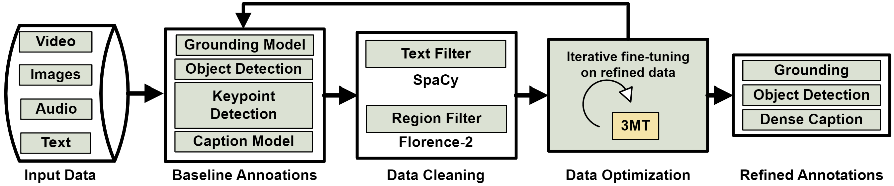

# [Scientific Reports] 3MT: Multimodal Multitask Learning for Real-Time Soccer Player Decision-Making Skills Analytics

  [](README.md)

<div align="center">
  
</div>

#### 1. Prepare Dataset
Make sure your dataset structure as follows:
```
├── 3MT++
│   ├── ISW-Actual
│   │   └── English
│   │   |   └── 2017
|   │   │   |   └── Game_A_720P
|   |   │   │   |   └── 1st_half.json
|   |   │   │   |   └── 2nd_half.json
|   │   │   |   └── Game_A_1080P
|   |   │   │   |   └── 1st_half.json
|   |   │   │   |   └── 2nd_half.json
│   │   └── EuroChamp
│   │   |   └── 2017
|   │   │   |   └── Game_A_720P
|   |   │   │   |   └── 1st_half.json
|   |   │   │   |   └── 2nd_half.json
|   │   │   |   └── Game_A_1080P
|   |   │   │   |   └── 1st_half.json
|   |   │   │   |   └── 2nd_half.json
│   │   └── French
│   │   |   └── 2017
|   │   │   |   └── Game_A_720P
|   |   │   │   |   └── 1st_half.json
|   |   │   │   |   └── 2nd_half.json
|   │   │   |   └── Game_A_1080P
|   |   │   │   |   └── 1st_half.json
|   |   │   │   |   └── 2nd_half.json
│   │   └── German
│   │   |   └── 2017
|   │   │   |   └── Game_A_720P
|   |   │   │   |   └── 1st_half.json
|   |   │   │   |   └── 2nd_half.json
|   │   │   |   └── Game_A_1080P
|   |   │   │   |   └── 1st_half.json
|   |   │   │   |   └── 2nd_half.json
│   │   └── Italian
│   │   |   └── 2017
|   │   │   |   └── Game_A_720P
|   |   │   │   |   └── 1st_half.json
|   |   │   │   |   └── 2nd_half.json
|   │   │   |   └── Game_A_1080P
|   |   │   │   |   └── 1st_half.json
|   |   │   │   |   └── 2nd_half.json
│   │   └── Spanish
│   │   |   └── 2017
|   │   │   |   └── Game_A_720P
|   |   │   │   |   └── 1st_half.json
|   |   │   │   |   └── 2nd_half.json
|   │   │   |   └── Game_A_1080P
|   |   │   │   |   └── 1st_half.json
|   |   │   │   |   └── 2nd_half.json
│   │   └── Others
│   │   |   └── 2017
|   │   │   |   └── Game_A_720P
|   |   │   │   |   └── 1st_half.json
|   |   │   │   |   └── 2nd_half.json
|   │   │   |   └── Game_A_1080P
|   |   │   │   |   └── 1st_half.json
|   |   │   │   |   └── 2nd_half.json
│   ├── ISW-Translated
│   │   └── English
│   │   |   └── 2017
|   │   │   |   └── Game_A_720P
|   |   │   │   |   └── 1st_half.json
|   |   │   │   |   └── 2nd_half.json
|   │   │   |   └── Game_A_1080P
|   |   │   │   |   └── 1st_half.json
|   |   │   │   |   └── 2nd_half.json
│   │   └── EuroChamp
│   │   |   └── 2017
|   │   │   |   └── Game_A_720P
|   |   │   │   |   └── 1st_half.json
|   |   │   │   |   └── 2nd_half.json
|   │   │   |   └── Game_A_1080P
|   |   │   │   |   └── 1st_half.json
|   |   │   │   |   └── 2nd_half.json
│   │   └── French
│   │   |   └── 2017
|   │   │   |   └── Game_A_720P
|   |   │   │   |   └── 1st_half.json
|   |   │   │   |   └── 2nd_half.json
|   │   │   |   └── Game_A_1080P
|   |   │   │   |   └── 1st_half.json
|   |   │   │   |   └── 2nd_half.json
│   │   └── German
│   │   |   └── 2017
|   │   │   |   └── Game_A_720P
|   |   │   │   |   └── 1st_half.json
|   |   │   │   |   └── 2nd_half.json
|   │   │   |   └── Game_A_1080P
|   |   │   │   |   └── 1st_half.json
|   |   │   │   |   └── 2nd_half.json
│   │   └── Italian
│   │   |   └── 2017
|   │   │   |   └── Game_A_720P
|   |   │   │   |   └── 1st_half.json
|   |   │   │   |   └── 2nd_half.json
|   │   │   |   └── Game_A_1080P
|   |   │   │   |   └── 1st_half.json
|   |   │   │   |   └── 2nd_half.json
│   │   └── Spanish
│   │   |   └── 2017
|   │   │   |   └── Game_A_720P
|   |   │   │   |   └── 1st_half.json
|   |   │   │   |   └── 2nd_half.json
|   │   │   |   └── Game_A_1080P
|   |   │   │   |   └── 1st_half.json
|   |   │   │   |   └── 2nd_half.json
│   │   └── Others
│   │   |   └── 2017
|   │   │   |   └── Game_A_720P
|   |   │   │   |   └── 1st_half.json
|   |   │   │   |   └── 2nd_half.json
|   │   │   |   └── Game_A_1080P
|   |   │   │   |   └── 1st_half.json
|   |   │   │   |   └── 2nd_half.json
```

## Acknowledgement

This repository builds upon several open-source projects and research contributions. The real-time object detection foundation is adapted from [Ultralytics](https://github.com/ultralytics/ultralytics) and [Mamba YOLO](https://github.com/HZAI-ZJNU/Mamba-YOLO). The selective scan mechanism is inspired by [VMamba](https://github.com/MzeroMiko/VMamba), while the contrastive vision encoder is based on [SigLip](https://arxiv.org/abs/2303.15343). Additionally, the vision-language capabilities are powered by the [Florence-2](https://github.com/anyantudre/Florence-2-Vision-Language-Model) model.

## Citations
If you find [3MT](https://github.com/MrFahad/3MT.git) is useful in your research or applications, please consider giving us a star 🌟 and citing it.

```bibtex
@misc{majeed2025_3mt,
      title={3MT: Multimodal Multitask Learning for Real-Time Soccer Player
Decision-Making Skills Analytics }, 
      author={Fahad Majeed, Marco Agus, Jens Schneider},
      year={2025},
}
```

